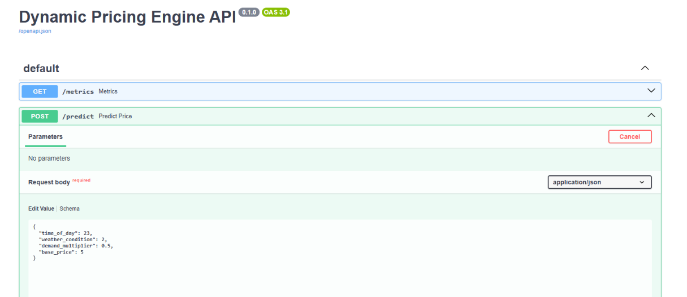
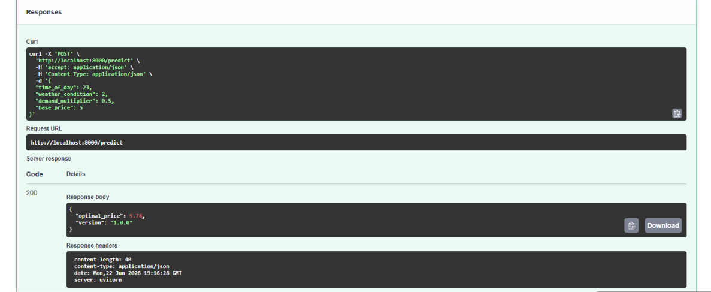
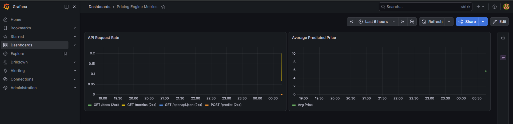

# End-to-End Dynamic Pricing Engine (MLOps)

This repository contains a production-grade, end-to-end Machine Learning Operations (MLOps) dynamic pricing engine designed to predict the optimal price for a simulated ride-sharing application. It showcases how to bridge the gap between offline model training and production-ready serving, monitoring, and containerization.

Made by **Siddhi Kumbhar**.

---

##  Key Features

* **Real-time Price Inference**: Serves model predictions with sub-second latency using FastAPI.
* **Production-Ready Input Validation**: Employs strict schema validation using Pydantic.
* **Automated Data Drift & API Monitoring**: Exposes Prometheus metrics and provisions a custom Grafana dashboard out of the box to track prediction distributions and detect data drift.
* **Containerized Infrastructure**: Packages the API, Prometheus, and Grafana into a single, multi-container Docker Compose application.
* **CI/CD Pipeline**: Runs linting, testing, and Docker builds automatically via GitHub Actions on every push.

---

##  Tech Stack

* **Machine Learning**: Python, XGBoost, Scikit-Learn, Pandas, NumPy
* **API Serving**: FastAPI, Uvicorn, Pydantic
* **Monitoring & Observability**: Prometheus, Grafana
* **Containerization & Orchestration**: Docker, Docker Compose
* **CI/CD**: GitHub Actions

---

##  System Architecture

1. **Synthetic Data Generator (`data_pipeline/generate_data.py`)**:
   Generates a synthetic historical dataset simulating ride-sharing trips. Features include `time_of_day`, `weather_condition` (Clear, Rain, Snow), `demand_multiplier`, and `base_price`. The target `optimal_price` is calculated with realistic market noise and business rules.

2. **Model Training Pipeline (`training/train.py`)**:
   Loads the historical dataset, splits it into training/validation sets, and trains an **XGBoost Regressor** model. The model is saved to `model/xgboost_pricing_model.json`.

3. **FastAPI Inference Service (`app/main.py`)**:
   Exposes a `/predict` POST endpoint for real-time pricing queries. It validates inputs via Pydantic (`app/schemas.py`) and implements custom Prometheus histogram metrics (`predicted_price`) to monitor prediction distributions.

4. **Monitoring Stack (`prometheus/`, `grafana/`)**:
   * **Prometheus**: Configured to scrape the FastAPI `/metrics` endpoint every 5 seconds.
   * **Grafana**: Automated via provisioning configurations to load Prometheus as a default datasource and set up the **"Pricing Engine Metrics"** dashboard upon startup.

5. **Traffic & Drift Simulator (`simulator/traffic_simulator.py`)**:
   Simulates active user traffic by sending continuous requests to the API. It periodically generates out-of-distribution high demand queries to simulate **data drift**, allowing you to observe drift spikes directly in Grafana.

---

##  Screenshots & Demo

### 1. Swagger UI - API Schema and Request Input
The FastAPI endpoint validates incoming pricing requests using Pydantic schemas, preventing invalid features from reaching the model.



### 2. Swagger UI - Model Prediction Response
When a valid payload is received, the model outputs the optimal price, enforcing business guardrails (e.g. `optimal_price` cannot fall below `base_price`).



### 3. Grafana Monitoring Dashboard
The Grafana dashboard visualizes scrapings from Prometheus, letting you track total requests, error rates, and distribution of predicted prices to check for real-time model drift.



---

##  How to Run & Test

### Option 1: Running with Docker (Recommended)

To spin up the entire containerized API, Prometheus, and Grafana stack, simply run:

```bash
docker compose up -d --build
```

#### Accessing the Stack:
* **FastAPI Docs (Swagger UI)**: [http://localhost:8000/docs](http://localhost:8000/docs)
* **Prometheus Dashboard**: [http://localhost:9090](http://localhost:9090)
* **Grafana Portal**: [http://localhost:3000](http://localhost:3000) (Login: `admin` / `admin`)

---

### Option 2: Running Locally (Without Docker)

1. **Set up a Virtual Environment**:
   ```bash
   python -m venv venv
   # On Windows:
   .\venv\Scripts\activate
   # On Unix/macOS:
   source venv/bin/activate
   ```

2. **Install Dependencies**:
   ```bash
   pip install -r requirements.txt
   ```

3. **Synthesize Data & Train the Model**:
   ```bash
   python data_pipeline/generate_data.py
   python training/train.py
   ```

4. **Start the API Server**:
   ```bash
   uvicorn app.main:app --host 0.0.0.0 --port 8000
   ```

5. **Start the Traffic Simulator**:
   Open a separate terminal, activate the environment, and run:
   ```bash
   python simulator/traffic_simulator.py
   ```

---

